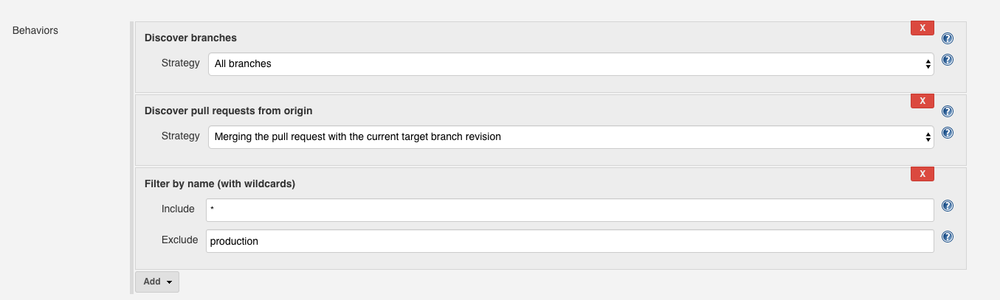

# Jenkins Pipelines
A Jenkins pipeline is a script that takes your application from version control to deployment. The pipeline file is kept in your application's Github repository, follows normal pull request review procedure, and is promoted from dev/qa/prod using the same process as your code.

Jenkins pipelines have several flavours. Unless you have reason to deviate, our standards are multi-branch declarative pipelines. Multi-branch pipelines will detect all branches & pull requests and run them inside the "parent" job: perfect for running tests or deploying dev/qa environments. There may be cases where this is *not* appropriate, such as a pipeline that runs on a schedule and kicks off a scheduled deployment.

Documentation on the declarative Jenkinsfile syntax can be found [on the Jenkins website](https://jenkins.io/doc/book/pipeline/syntax/).

:::warning Legacy Jenkins Jobs
If you have used Jenkins in the past, you may be familiar with configuring jobs.

These legacy-style jobs should be replaced by pipelines files kept in version control. No new jobs should be configured this way.
:::

We typically keep pipeline files in a `.jenkins/` folder. Even if you only have a single Jenkinsfile, it is advisable to put it in the folder; changing it later is a nuisance. 

## Configuration
As much configuration as possible should be included in the Jenkinsfile. 

- Review the [options](https://jenkins.io/doc/book/pipeline/syntax/#options) section
    - `disableConcurrentBuilds()` is a commonly-used option; you wouldn't want to `terraform apply` off the same tfstate file at the same time.
- Review the [triggers](https://jenkins.io/doc/book/pipeline/syntax/#triggers) section
    - `pollSCM('H/10 * * * *')` is popular; Jenkins is firewalled off so Github cannot notify it when code is pushed
- Review the [parameters](https://jenkins.io/doc/book/pipeline/syntax/#parameters) section, if you need inputs

The most notable item that you cannot include is branch discovery for a multi-branch pipeline. This must be configured in the Jenkins UI:



## Credentials
Jenkins has a credential store that your pipelines may access. These credentials are items necessary for deployments.

Out of the box, three credentials will exist:

- `terraform`, an AWS credential for creating resources via Terraform
- `teams-build-webhook`, the URL for posting status messages to Teams
- `GitHub-awsCloudOpsCJT`, a Github user in our organization

You can ask the EACD-CloudOps group for help if you need to add pipeline-specific secrets to your Jenkins servers.

## Agents
By default, a pipeline will run on the main Jenkins server. It will have the tools available on a fairly standard CentOS Linux installation, plus the `terraform` binary and docker CLI tools.

If you need more specialized tools -- specific versions of NodeJS for example -- you can use a Docker agent instead:

```groovy
agent {
    docker {
        image 'node:10'
    }
}
```

You can choose an agent for your pipeline file or for specific stages. Jenkins will download the Docker image from Docker Hub and execute your pipeline inside of that container. If no community-maintained image is available for your needs, you can write your own Dockerfile and use it as the agent as well.

### Heavy Tasks
For small units of work, running things on the Jenkins server is fine. However, when running more computationally-expensive pipelines, you are liable to consume all available CPU/memory. Jenkins may become unresponsive, unable to run additional tasks, or crash.

Instructions on offloading to dedicated worker hosts can be found in the [Jenkins ECS Agent](./jenkins-ecs-agent.md) article. The EACD-CloudOps group may request you convert some pipeline(s) to using an ECS agent as problems are discovered.

## Example Pipeline
This is an example pipeline for testing a PHP 7.4 application. The entire pipeline runs in a community-maintained Docker image pulled in from Docker Hub. Jenkins will scan GitHub for any new commits every 10 minutes, and kick the pipeline off for any new/changed branches. When it runs, it will ping a Teams channel. If the build succeeds or fails, a follow-up will be posted to Teams.

The very first line (`#!groovy`) is a trick we use to get correct syntax highlighting in VSCode. It has no other effect.

```groovy
#!groovy
pipeline {
    agent {
        docker {
            image 'edbizarro/gitlab-ci-pipeline-php:7.4'
            args '-u root:root'
        }
    }

    environment {
        TEAMS_WEBHOOK_URL = credentials('teams-build-webhook')
    }

    triggers {
        pollSCM('H/10 * * * *')
    }


    options {
        disableConcurrentBuilds()
    }

    stages {
        stage ('Send Notifications') {
            steps {
                office365ConnectorSend status: "Started", webhookUrl: "${env.TEAMS_WEBHOOK_URL}"
            }
        }

        stages {
            stage ('Test') {
                steps {
                    sh 'composer install'
                    sh './vendor/bin/phpunit'
                }
            }
        }
    }

    post {
        success {
            office365ConnectorSend status: "Success!", webhookUrl: "${env.TEAMS_WEBHOOK_URL}"
        }

        failure {
            office365ConnectorSend status: "Failed", webhookUrl: "${env.TEAMS_WEBHOOK_URL}"
        }
    }
}
```

## Scheduling Deployments
You must regularly re-deploy your application. Our minimum is once per week, but more frequent deployments are encouraged.

Re-deploying on a schedule, even when no changes are pending deployment, ensures that your pipeline & deployment process is valid. Some applications may go into a period of development inactivity; it's good to know that you can apply a critical security patch without worrying if your pipeline still works after not being used for nine months.

You can create a pair of regular (not multi-branch) pipelines that trigger your main Jenkinsfile's develop/qa & production branch builds. 

Here is an example Jenkinsfile that will schedule itself to run every day at noon. When it runs, it will trigger a build for the `develop` branch in the `OnBase SSO Shim` multi-branch pipeline. This way, it's using the exact same deployment process as when changes are pushed to `develop`. Once that run is done, it will do the same for the `qa` branch:

```groovy
#!groovy
pipeline {
    agent any

    triggers {
        cron('H 12 * * *')
    }

    stages {
        stage ('Deploy Sub-production') {
            steps {
                build(job: 'OnBase SSO Shim/develop')
                build(job: 'OnBase SSO Shim/qa')
            }
        }
    }
}
```