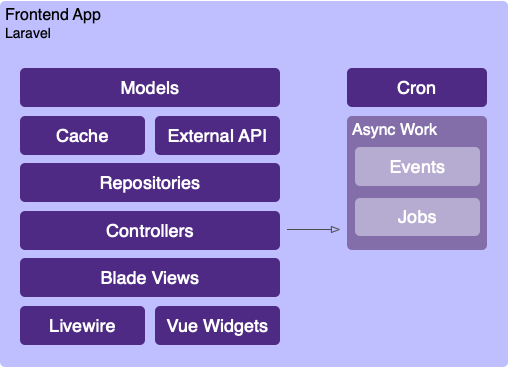
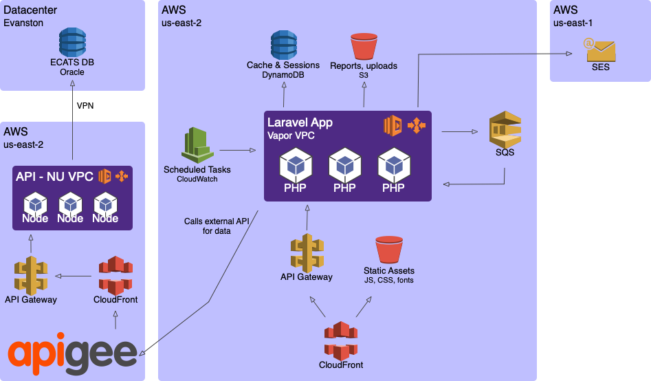

# Application Patterns
These are case studies for successful application architectures on the cloud. If you are developing a brand new app, one of these cases should get you started off on the right path.

We are making an effort to standardize around a small number stacks & patterns so it is easier for developers to work cross-team. These patterns adhere to our [design principles](./design-principles.md).

## Express App
[Express](https://expressjs.com/) is the most popular web framework for Node. It can be [adapted to run on Lambda](https://github.com/awslabs/aws-serverless-express) with a middleware, making this easy to run locally for development or on AWS for production.

:::warning Stub
We have several NodeJS apps in production and are evlauating them to produce the best pattern. 

More information will be available soon.
:::

## Laravel App
[Laravel](https://laravel.com/) is an excellent choice for cloud applications. It is a modern framework with [advanced](https://laravel.com/docs/7.x/events) [features](https://laravel.com/docs/7.x/broadcasting), and it's easy to deploy on AWS with [Vapor](../infrastructure/vapor.md). 

Our general pattern for Laravel apps closely mirrors a new out-of-the-box Laravel installation. In cases where we are interacting with APIs heavily, we will make more use of the cache and implement a repository pattern around our models:



### Repositories
In a normal Laravel app, you are assumed to have a relational database. [Eloquent](https://laravel.com/docs/7.x/eloquent) is an active record ORM, so models encapsulate both your domain models (e.g. attributes & method you add) and the data storage logic (`save()`, `find()`, etc).

In some situations, it is better to hide the details of data storage with a repository class:

- The logic is complicated and thus should not live in your controller
- The model isn't stored in your database (and thus is not an Eloquent model)

If you have used Hibernate in Java, a repository is essentially a [data access object](https://en.wikipedia.org/wiki/Data_access_object): a dedicated class that reads & writes models from storage. The storage could be anything: a database, an API, or a cache. The model and all of its business logic is a separate object that you pass in & get out of the repository.

A repository method should not be aware of any validation logic, business logic, roles, or privileges. All of the data it needs should be validated elsewhere & passed in. The method should only be invoked if it is appropriate to do so.

The only logic included in a repository should be related to persisting data -- e.g. if we specify `column_a`, then `column_b` should be nulled out, or if `column_c` has changed we should add an entry to `audit_log`.

We keep the repositories in `app/Repositories`. Methods should return the relevant model w/ its updates. Whenever possible, complex write operations should be wrapped in a transaction.

:::details Eloquent Repository Example
```php
namespace App\Repositories;

use Carbon\Carbon;
use App\Models\Application;
use App\Models\Status;

class ExampleRepository
{
    public function updateStatus(Application $app, Status $status, $user_id = null): Application
    {
        return DB::transaction(function () use ($app, $status, $user_id) {
            $app->status()->associate($status);

            $milestone_at_column = $status->milestone_timestamp_column;
            if ($milestone_at_column != null) {
                $app->$milestone_at_column = Carbon::now();
            }

            $milestone_by_user_column = $status->milestone_track_user_id_column;
            if ($milestone_by_user_column != null) {
                $app->$milestone_by_user_column = $user_id;
            }

            $app->save();

            // Update the updated_at timestamp on the underlying app
            $app->application->touch();

            return $app->refresh();
        });
    }
}
```
:::
:::details API Repository Example
```php
namespace App\Repositories;

use App\API\ExternalAPI;
use App\Models\Application;
use App\Models\Status;

class ExampleRepository
{
    private $api;

    public function __construct(ExternalAPI $api)
    {
        $this->api = $api;
    }

    public function get(string $id): Application
    {
        // Logic for re-trying & auth should live in your API binding class
        $raw_data = $this->api->get($id);

        // Hydrate & return a model
        return new Application($raw_data);
    }

    public function updateStatus(Application $app, Status $status, $user_id = null): Application
    {
        $this->api->update($app->id, [
            'status_id' => $status->id,
        ]);

        return $this->get($app->id);
    }
}
```
:::

### Frontend
We are using [Livewire](https://laravel-livewire.com/) to create interactive UIs without needing to write any Javascript. In cases where Livewire would not be suitable for a UI component -- something purely client-side, like a [nested dropdown](https://vue-treeselect.js.org/#basic-features) -- you can supplement it Vue components. 

Livewire is not an all-or-nothing tool. You can livewire every screen, or build your app the traditional way and choose to livewire only a few specific pieces.

There is a Northwestern [Bootstrap 4](https://getbootstrap.com/) theme available. Bootstrap depends on jQuery, but you should avoid using it for custom code as much as possible: Livewire and/or Vue are more powerful tools.

### Infrastructure & MASA Apps
We always want to expose an application's data via an API. This will allow other Northwestern developers to create [mashup-](https://en.wikipedia.org/wiki/Mashup_(web_application_hybrid)) or [MASA-](https://www.gartner.com/document/3980382) style applications, aggregating data from several sources to create something tailored to their audience. 

For example, a college's IT group may wish to build a homepage aggregating directory information for their faculty plus open faculty positions -- sets of data that traditionally come from very different systems. If both of these systems expose themselves with APIs, it's only a matter of browsing the API Service Registry for appropriate services and getting approval from the data owners.

An increasing number of our own applications follow this pattern. Here is a full infrastructure diagram for applications built this way: on the left is a dedicated API, written in NodeJS, that accesses an on-prem Oracle database. This database is a system-of-record, fully exposed (read & write) through a serverless API.

On the right is a Laravel Vapor app that serves as a UI. It interacts with the database exclusively through the NodeJS API.



All of the services attached to the Laravel app are automatically wired up by Vapor.  You do not need to think about setup for any of these services; just use the relevant framework features.

- Firing events or dispatching asynchronous jobs will write data to SQS and trigger additional Lambda executions
- Static assets are automatically deployed to CloudFront & the CDN domain injected into your views
- The cache (which includes Laravel sessions) used DynamoDB by default
- The [scheduler](https://laravel.com/docs/7.x/scheduling) is set up with a CloudWatch scheduled event
- An optional S3 bucket for application data & file uploads can be opted in to from the `vapor.yml` config file

In the above example, there is no database for the Laravel UI and only one backing API. This is only done to create a simple diagram. If you want to store your own data or annotate data from another service, add a DB to your Laravel app, or grab data from another API. If you create data mash-ups, you should consider exposing these with your own API built on top of the Laravel app and register them in the API Service Registry for other developers to utilize.
