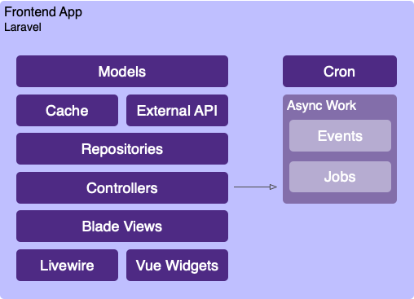

# Laravel Stack
[Laravel](https://laravel.com/) is an excellent choice for cloud applications. It is a modern framework with [advanced](https://laravel.com/docs/8.x/events) [features](https://laravel.com/docs/8.x/broadcasting), and it's easy to deploy on AWS with [Vapor](../infrastructure/vapor.md). 

Our general pattern for Laravel apps closely mirrors a new out-of-the-box Laravel installation. In cases where we are interacting with APIs heavily, we will make more use of the cache and implement a repository pattern around our models:



## Stack
Laravel provides most of the application stack.

:::tip The Administrative Systems Seal of Approval
These serve as a good set of "default" options for things.

There may be use-cases where something else is better, but unless & until a justification can be made to use something else, you should draw from this list. 

Using the same libraries will allow AS developers to transfer between projects more easily, as technical competencies developed in one project will be transferrable to other projects.
:::

| Package                                                                                                | Purpose                             | 
|--------------------------------------------------------------------------------------------------------|-------------------------------------|
| PostgreSQL *(available as Aurora Serverless RDS for PostgreSQL on AWS)*                                | Relational DB                       |
| AWS DynamoDB                                                                                           | Document DB, session store, cache   |
| [Eloquent](https://laravel.com/docs/8.x/eloquent)                                                      | DB access / ORM                     |
| [laravel-soa](https://nit-administrative-systems.github.io/SysDev-laravel-soa/)                        | WebSSO, common API bindings         | 
| [Guzzle](https://docs.guzzlephp.org/en/stable/)                                                        | HTTP client                         |
| [Carbon](https://carbon.nesbot.com/docs/)                                                              | DateTime & timezone manipulation    |
| [libphonenumber](https://github.com/google/libphonenumber#third-party-ports)                           | Phone number info & validation      |
| [Pusher Channels](https://laravel.com/docs/8.x/broadcasting#pusher-channels)                           | Websocket driver for broadcasting   |
| [Blade](https://laravel.com/docs/8.x/blade)                                                            | Templating engine                   |
| [northwestern-laravel-ui](https://nit-administrative-systems.github.io/northwestern-laravel-ui)        | Bootstrap 4 theme & layouts         |
| [Yarn](https://yarnpkg.com/)                                                                           | Front-end package management        |
| [Bootstrap 4](https://getbootstrap.com/) <sup>\*</sup>                                                 | General purpose UI toolkit          |
| [Font Awesome](https://fontawesome.com/) <sup>\*</sup>                                                 | Icons                               |
| [PHPUnit](https://phpunit.de/)                                                                         | Unit & feature testing              |
| [Livewire](https://laravel-livewire.com/)                                                              | Rich UI                             |
| [Laravel Dusk](https://laravel.com/docs/8.x/dusk) *(Selenium)*                                         | Functional & E2E testing            |
| [sentry-php](https://github.com/getsentry/sentry-php)                                                  | Exception logging (backend)         |
| [@sentry/browser](https://www.npmjs.com/package/@sentry/browser) †                                     | Exception logging (frontend)        | 
| [Horizon](https://laravel.com/docs/8.x/horizon) with Redis                                             | Queues & async processing (on-prem) | 
| [vapor-ui](https://github.com/laravel/vapor-ui) with Amazon SQS                                        | Queues & async processing (AWS)     | 
| Apache & PHP-FPM                                                                                       | On-prem deployment                  |
| [Laravel Vapor](https://vapor.laravel.com/)                                                            | AWS serverless deployment           |

<small><sup>*</sup> The `northwestern-laravel-ui` package will set up Bootstrap & Font Awesome.</small>

<small>† The `northwestern-laravel-ui` package includes Sentry's browser SDK and will auto-configure it based on the settings for `sentry-php`.</small>

## Frontend
For applications, this stack uses Bootstrap with an NU theme. This does not try to replicate the look of the [NU Department Templates](https://www.northwestern.edu/templates/v3/), but still gives you an obviously-NU-branded look & feel.

Bootstrap is our tool of choice here because it is providing a large number of ready-made UI components that have been tested cross-browser & for accessibility. This allows developers to focus on the custom business logic for their application instead of CSS arcana.

For AJAX-y things you'd typically achieve with jQuery, instead consider Livewire. Livewire enables us to write rich AJAX-y UIs entirely in PHP and Blade. This makes the application more testable (PHPUnit can test this code), and transfers competency with PHP & Blade to the frontend instead of requiring you to write JavaScript.

Note that [the use of jQuery should be phased out](http://localhost:8080/AS-CloudDocs/development/frontend-stacks.html#phasing-out-jquery) across all applications.

:::tip Easing in to Livewire
Livewire is not a replacement for a frontend framework. It does not take control of the entire frontend.

You can begin adding Livewire to an existing Laravel application gradually. If a developer is working on a new feature, they can add a Livewire component without disrupting any of the existing functionality.
:::

Livewire is not appropriate for all tasks jQuery is used for. If you need to do something purely client-side in the browser, it is recommended to write 'vanilla' JavaScript without depending on any additional libraries/frameworks.

## Repositories
In a normal Laravel app, you are assumed to have a relational database. [Eloquent](https://laravel.com/docs/8.x/eloquent) is an active record ORM, so models encapsulate both your domain models (e.g. attributes & method you add) and the data storage logic (`save()`, `find()`, etc).

In some situations, it is better to hide the details of data storage with a repository class:

- The logic is complicated and thus should not live in your controller
- The model isn't stored in your database (and thus is not an Eloquent model)

If you have used Hibernate in Java, a repository is essentially a [data access object](https://en.wikipedia.org/wiki/Data_access_object): a dedicated class that reads & writes models from storage. The storage could be anything: a database, an API, or a cache. The model and all of its business logic is a separate object that you pass in & get out of the repository.

A repository method should not be aware of any validation logic, business logic, roles, or privileges. All of the data it needs should be validated elsewhere & passed in. The method should only be invoked if it is appropriate to do so.

The only logic included in a repository should be related to persisting data -- e.g. if we specify `column_a`, then `column_b` should be nulled out, or if `column_c` has changed we should add an entry to `audit_log`.

We keep the repositories in `app/Repositories`. Methods should return the relevant model w/ its updates. Whenever possible, complex write operations should be wrapped in a transaction.

:::details Eloquent Repository Example
```php
namespace App\Repositories;

use Carbon\Carbon;
use App\Models\Application;
use App\Models\Status;

class ExampleRepository
{
    public function updateStatus(Application $app, Status $status, $user_id = null): Application
    {
        return DB::transaction(function () use ($app, $status, $user_id) {
            $app->status()->associate($status);

            $milestone_at_column = $status->milestone_timestamp_column;
            if ($milestone_at_column != null) {
                $app->$milestone_at_column = Carbon::now();
            }

            $milestone_by_user_column = $status->milestone_track_user_id_column;
            if ($milestone_by_user_column != null) {
                $app->$milestone_by_user_column = $user_id;
            }

            $app->save();

            // Update the updated_at timestamp on the underlying app
            $app->application->touch();

            return $app->refresh();
        });
    }
}
```
:::
:::details API Repository Example
```php
namespace App\Repositories;

use App\API\ExternalAPI;
use App\Models\Application;
use App\Models\Status;

class ExampleRepository
{
    private $api;

    public function __construct(ExternalAPI $api)
    {
        $this->api = $api;
    }

    public function get(string $id): Application
    {
        // Logic for re-trying & auth should live in your API binding class
        $raw_data = $this->api->get($id);

        // Hydrate & return a model
        return new Application($raw_data);
    }

    public function updateStatus(Application $app, Status $status, $user_id = null): Application
    {
        $this->api->update($app->id, [
            'status_id' => $status->id,
        ]);

        return $this->get($app->id);
    }
}
```
:::

## Deploying
Laravel apps can be deployed on-premise (legacy applications) or on AWS.

When on-prem, the servers are Cyberinfrastructure-supported RedHat Enterprise Linux VMs. The latest version of PHP available in the RedHat Software Collections (RHSCL) should be used.

For cloud deployments, we use Laravel Vapor to deploy onto AWS. Please see the article on [Vapor under the infrastructure section](../infrastructure/vapor.md) for more information about deploying with Vapor.