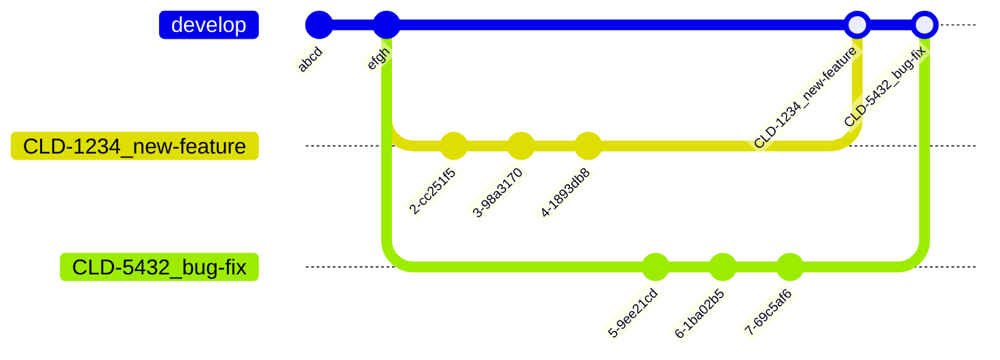

# Workflows
Git does not prescribe a specific branching model or workflow. There are a number of different workflows that we can use, and the best workflow for any given situation will depend on a number of factors.

This article contains several *suggested* workflows for different use-cases. AS staff are encouraged to adopt one of these workflows for consistency across the organization.

:::tip Workflow Documentation Policy
We have a huge number of projects all utilizing different workflows. Some are older projects that have not been brought "up to code". Some have good reasons for using a non-standard workflow.

Our policy is that, no matter what workflow you use, you should document your workflow on a per-project basis. You can link to this article to avoid duplication, but each repository should indicate to developers what workflow should be used. 

This documentation should be somewhere prominent, where somebody brand-new can find it: either in the repository's `README.md` file, or in project onboarding materials.
:::

## Suggested Application Workflow
This workflow is suggested for applications deployed to a development, QA, and production environment. This can be used for web applications, integrations, microservices, and similar.

| Pros                                                             | Cons                                                                          |
|------------------------------------------------------------------|-------------------------------------------------------------------------------|
| Very clean history, with the deployed branches remaining in sync | Requires solid understanding of Git & strict discipline with QA/prod branches |
| Easy to revert PRs                                               | No UI in GitHub for promoting code to higher environments                     |
| Simple deployment model: what you see is what is live            | Changes made directly to QA/prod are overwritten                              |

At a high level: all work is done in feature branches. When code review is complete, the entire branch is squashed to one commit and that is merged to `develop`[^1] with a fast-forward merge[^2]. When you are ready to promote work to a higher environment, you replace the `qa` branch with the `develop` branch by reseting it and overwriting the history on GitHub[^3].

[^1]: This is known as a [Squash Merge](https://docs.github.com/en/pull-requests/collaborating-with-pull-requests/incorporating-changes-from-a-pull-request/about-pull-request-merges#squash-and-merge-your-commits).

[^2]: Fast forward merges never have a merge commit. Merge commits are kind of a pain to revert, since they refer to several *other* commits.

[^3]: Resetting avoids merge conflicts and merge commits when promoting code. Merge commits when moving code from dev -> QA -> prod have been a huge source of confusion for people, since their commit IDs do not match. This drives situations where develop/QA/production are "500 ahead, 500 behind" from each other with confusing diffs. 

You should create a protected branch for each deployed environment. For example, `develop`, `qa`, and `production` branches. The lowest environment should be your default branch, from where all new work begins.

If a feature needs to be pulled, it can be taken out by reverting the one commit. If a hotfix is neeed, a commit from `develop` can be cherry-picked to `qa` and `production`.

### Doing Work
Developers should create branches from the default branch (typically `develop`) to work in. This is appropriate for developing features, bugfixes, or anything else.

## Suggested Library Workflow
This workflow is suggested for libraries and packages that are *released* as opposed to *deployed*. 