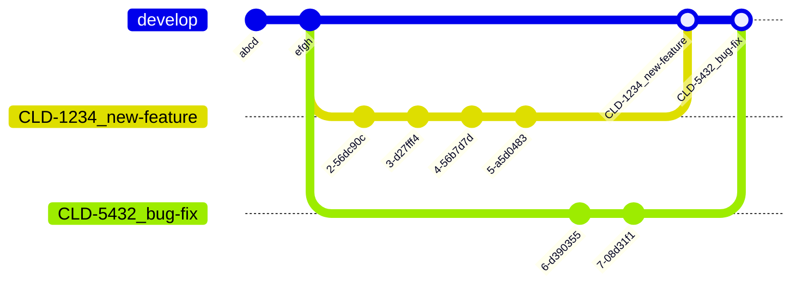

# Workflows
Git does not prescribe a specific branching model or workflow. There are a number of different workflows that we can use, and the best workflow for any given situation will depend on a number of factors.

This article contains several *suggested* workflows for different use-cases. AS staff are encouraged to adopt one of these workflows for consistency across the organization.

:::tip Workflow Documentation Policy
We have a huge number of projects all utilizing different workflows. Some are older projects that have not been brought "up to code". Some have good reasons for using a non-standard workflow.

Our policy is that, no matter what workflow you use, you should document your workflow on a per-project basis. You can link to this article to avoid duplication, but each repository should indicate to developers what workflow should be used. 

This documentation should be somewhere prominent, where somebody brand-new can find it: either in the repository's `README.md` file, or in project onboarding materials.
:::

## Suggested Application Workflow
This workflow is suggested for applications deployed to a development, QA, and production environment. You can use this for web applications, integrations, microservices, and similar.

| Pros                                                             | Cons                                                                          |
|------------------------------------------------------------------|-------------------------------------------------------------------------------|
| Very clean history, with the deployed branches remaining in sync | Requires solid understanding of Git & strict discipline with QA/prod branches |
| Easy to revert PRs                                               | No UI in GitHub for promoting code to higher environments                     |
| Simple deployment model: what you see is what is live            | Changes made directly to QA/prod are overwritten                              |

At a high level: all work is done in feature branches. When code review is complete, the entire branch is squashed to one commit and that is merged to `develop`[^1] with a fast-forward merge[^2]. When you are ready to promote work to a higher environment, you replace the `qa` branch with the `develop` branch by reseting it and overwriting the history on GitHub[^3].

[^1]: This is known as a [Squash Merge](https://docs.github.com/en/pull-requests/collaborating-with-pull-requests/incorporating-changes-from-a-pull-request/about-pull-request-merges#squash-and-merge-your-commits).

[^2]: Fast forward merges never have a merge commit. Merge commits are kind of a pain to revert, since they refer to several *other* commits.

[^3]: Resetting avoids merge conflicts and merge commits when promoting code. Merge commits when moving code from dev -> QA -> prod have been a huge source of confusion for people, since their commit IDs do not match. This drives situations where develop/QA/production are "500 ahead, 500 behind" from each other with confusing diffs. 

You should create a protected branch for each deployed environment. For example, `develop`, `qa`, and `production` branches. The lowest environment should be your default branch, from where all new work begins.

If a feature needs to be rolled back, it can be taken out by reverting the one commit. If a hotfix is needed, a commit from `develop` can be cherry-picked to `qa` and `production` ahead of promoting the entire `develop` branch.

### Doing Work
You should create branches from the default branch (typically `develop`) to work in. This is appropriate for developing features, bugfixes, or anything else.

When JIRA is in use, the branch name should align to the JIRA ticket number. For example, if working `CLD-1234`, the branch should be prefixed with that ticket, followed by a brief description of what the branch is: `CLD-1234_new-feature`. This allows JIRA to detect the branch and associate it with the ticket so leads, managers, and PMs can track the work's progress through development and merging.

You should create a draft PR as early as feasible. Once you have a draft PR open, GitHub will run the code style fixer when you push, runs the unit & end-to-end test suites to let you know about any regressions you've created, and reports on unit test coverage via Coveralls. This is all useful information to have available during development.

When you are done working, you can mark the draft PR as ready for review. At minimum, your supervisor/manager or a product lead should be asked to review the pull request. You can ask for reviews from other developers too; if somebody has expertise in the area you're working in, their insight may be valuable.

When code review is complete, the tech leads will merge your PR using the squash & merge strategy. You'll be prompted to fill out the commit message. If JIRA is being used, the summary line should begin with the ticket number: `CLD-1234 - New Feature`. This ensures every line of code is associated with a JIRA ticket in the `git blame` view.

:::warning PRs Must Be Production-Ready
In this workflow, any PR that is merged to `develop` should be ready to go to `production`.

PRs marked as ready for review should leave the application in a working state. If partial work is being merged, it needs to be in a state that will not adversely impact the app. Incomplete features can be made inaccessible or disabled with a setting. 

Obviously bugs happen; those are unexpected, and there are testing opportunities. 
:::

The feature branch can be deleted once merged to `develop`[^4]. Merges are done by squashing the PR into one commit and then rebasing develop. This keeps the history very clean -- one commit per PR.

[^4]: GitHub can be configured to delete the branch automatically when the PR is merged.

If the `package.lock`, `yarn.lock`, or similar file[^5] has been updated by the PR, it's usually necessary to rebase and re-run the package managers' update commands. The tech leads will take care of this just prior to merging. This ensures the lock files are correct when changes from multiple tickets come together in `develop`.

[^5]: These are files generated by a package manager. Most package managers let you specify a version constraint to install -- "any 1.x version" -- and the lock file records what was *actually* installed -- `v1.22.4`. These files are huge & generated by the package manager; they are not meant for human consumption, and trying to resolve conflicts is nigh-impossible.

Here are two developers working on a pair of feature branches. Both begin from `develop` and have a bunch of commits over time. When they merge back to `develop`:

- The four commits for `CLD-1234_new-feature` becomes one single commit in `develop`
- The two commits for `CLD-5432_bug-fix` becomes one single commit in `develop`



### Promoting Code
Promoting code from the `develop` branch to QA/production (or other environments) involves *replacing* the higher environment's branch with the `git reset` command. This will move all changes to a higher environment.

This maintains a very clean history: the higher environment branches are exact copies of develop, but may be in the past. There are no merge commits or conflicts with this approach, and it is very easy to see how behind an environment is.

:::danger Do Not Commit to These Branches
It is not permitted to commit code to the `qa`/`production` environment branches.

Changes made directly to these branches **will be overwritten**. All code must be merged to the `develop` branch; it is the ultimate source of truth. The higher environment branches may be *behind* `develop`, but they can never be *ahead* of it.
:::

For a regular deployment, the branch from one environment lower is copied. For `qa` release, this means `develop` is copied. For a production release, `qa` is copied. 

The exact steps needed to promote code to an environment should be documented on a per-repository basis. This process should be as simple as copy-and-paste, and the exact branch names differ from repository-to-repository. Here is an example for `develop` -> `qa`:

```sh
git fetch
git checkout qa
git reset --hard origin/develop
git push --force
```

### Deploying Code
We want our environment branches to match what is deployed to their corresponding environment at all times. When an environment branch is updated, it should be automatically deployed to keep things in sync.

There should be no way to deploy an environment branch to the wrong environment, and this step must not require you to manually trigger it. Each environment branch should either match it's deployed environment, or be in the process of deploying changes to get itself there.

### Rolling Back
For ease of rollbacks, the deployment process can create tags. This may be desirable only for `production`. The easiest naming convention for these tags would be `release_{timestamp}`.

Ideally, your CI/CD pipeline should create the tag *after* a successful deployment; if it didn't successfully deploy, you probably don't care to roll back to it. 

The process for rolling back to a tag called `origin/release-2023-06-01-164412` is:

```sh
git fetch
git checkout production
git reset --hard origin/release-2023-06-01-164412
git push --force
```

The deployment pipeline would run as normal and re-deploy the environment.

### Hotfixes
Sometimes, you need to promote an urgent bugfix from `develop` to `production`.

Developing the change should follow the typical procedure for doing work: branch from `develop`, submit a pull request, and squash-merge it to `develop`.

Releasing it can be done by cherry-picking the commit ID(s) into the `qa`/`production` branches. The commands for this process should be documented on a per-repository basis. Here is an example of the process:

```sh
# First: make sure your copies of these branches match what is in Github
git fetch
git checkout develop && git pull
git checkout qa && git reset --hard origin/qa
git checkout prod && git reset --hard origin/prod

# Next, cherry-pick the commits from develop. 
# Repeat the cherry-picking as many times as necessary with each commit ID, 
# from oldest commit to newest.
git checkout qa # or prod
git cherry-pick xxxxxx

git push
```

You can encounter merge conflicts with this process in situations where you are hotfixing something that has changed dramatically in `develop`. This situation is rare, but should be handled with extreme care. Whatever you are doing to resolve the conflict will be overwritten & deleted during the next regular release. Evaluate if any other changes are needed in `develop`, and make sure they land there *before* the next promotion of `develop` to `qa`.

### Recommended Settings for GitHub
A `.github/CODEOWNERS` file should be added to the repository with at a wildcard entry for the team or product lead. This will automatically add the group as a reviewer on all pull requests. That automation ensures there is always somebody notified of a PR ready for review!

In the General settings tab, the following settings should be checked. These are all to add guard-rails around doing the wrong thing when merging PRs, or to automate parts of the process:

- Pull Requests -> *Allow merge commits* should be disabled
- Pull Requests-> *Allow squash merging* should be enabled
- Pull Requests -> *Allow rebase merging* should be disabled
- Pull Requests -> *Always suggest updating pull request branches* should be enabled
- Pull Requests -> *Automatically delete head branches* should be enabled (this is what auto-deletes a feature branch after merging it)

On the Branches tab, branch protection rules should be set up for the default branch (usually `develop`):

- *Branch pattern* is `develop`
- *Require linear history* should be enabled
- *Do not allow bypassing the above settings* should be enabled

There are other branch protection settings that you can consider enabling. For example, you might want to require all commits to `develop` come from a pull request with certain CI/CD checks having passed.

For other environment branches, branch protection should be set up, but with slightly different recommended settings:

- *Branch pattern* is `qa` (or `production`, or whatever other environment branch name you have)
- *Require linear history* should be enabled
- *Allow force pushes* should be enabled, and *Everyone* should be able to do it

## Suggested Library Workflow
This workflow is suggested for libraries and packages that are *released* as opposed to *deployed*. 

| Pros                                                  | Cons                                                   |
|-------------------------------------------------------|--------------------------------------------------------|
| Simple                                                | Doesn't account for maintaining several major versions |
| Easy to revert PRs                                    |                                                        |

At a high level: all work is done in feature branches. When code review is complete, the entire branch is squashed to one commit and that is merged to the `stable` branch. When it comes time to release, a tag is created for the new version.

Releasing a library update is typically publishing a tagged package to a registry, so there is no reason to maintain several branches. We have not (yet) had to maintain several major versions of a library concurrently, so that is not something this workflow accounts for. 

There will be a default branch (typically named `stable`), and short-lived feature/bugfix branches.

### Doing Work
You should create branches from the default branch (typically `stable`) to work in. This is appropriate for developing features, bugfixes, or anything else.

When JIRA is in use, the branch name should align to the JIRA ticket number. For example, if working `CLD-1234`, the branch should be prefixed with that ticket, followed by a brief description of what the branch is: `CLD-1234_new-feature`. This allows JIRA to detect the branch and associate it with the ticket so leads, managers, and PMs can track the work's progress through development and merging.

You should create a draft PR as early as feasible. Once you have a draft PR open, GitHub will run the code style fixer when you push, runs the unit & end-to-end test suites to let you know about any regressions you've created, and reports on unit test coverage via Coveralls. This is all useful information to have available during development.

:::tip Public Repositories
In most cases, our libraries are open source and the repository is public. Anyone on the internet can see your code and pull request. 

Be mindful that you are representing Northwestern University, and that nothing in the PR is private.
:::

When you are done working, you can mark the draft PR as ready for review. At minimum, your supervisor/manager or a product lead should be asked to review the pull request. You can ask for reviews from other developers too; if somebody has expertise in the area you're working in, their insight may be valuable.

When code review is complete, the tech leads will merge your PR using the squash & merge strategy. You'll be prompted to fill out the commit message. If JIRA is being used, the summary line should begin with the ticket number: `CLD-1234 - New Feature`. This ensures every line of code is associated with a JIRA ticket in the `git blame` view.

The feature branch can be deleted once merged to `develop`[^4]. Merges are done by squashing the PR into one commit and then rebasing develop. This keeps the history very clean -- one commit per PR.

[^4]: GitHub can be configured to delete the branch automatically when the PR is merged.

If the `package.lock`, `yarn.lock`, or similar file[^5] has been updated by the PR, it's usually necessary to rebase and re-run the package managers' update commands. The tech leads will take care of this just prior to merging. This ensures the lock files are correct when changes from multiple tickets come together in `stable`.

### Releasing a New Version
When the `stable` branch is in a release-ready state, a tag should be created through your git client or in the GitHub UI.

If a release artifact is required, it should be generated from CI/CD and either attached to the tag or published to an appropriate package registry.

Tags must follow [semantic versioning](https://semver.org/) practices, and should include a changelog file that confirms fo the [Keep a Changelog](https://keepachangelog.com/en/1.1.0/) standard. 