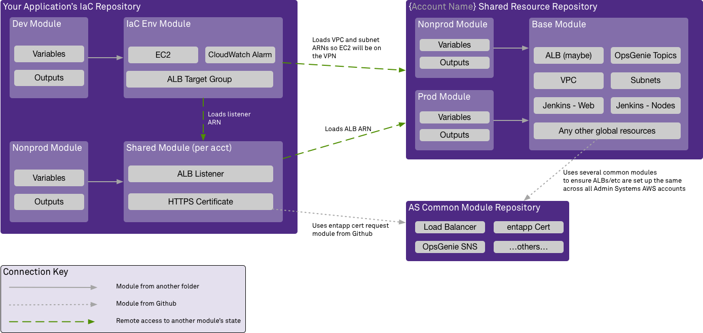

# Example Terraform Module
To illustrate the resource and module sharing concepts, think about an application deployed on the Elastic Container Service (ECS). You need the following resources:

- Per account
    - Load balancer listener for the application (nonprod's would cover dev/qa)
    - HTTPS certificate for the load balancer

- Per application environment
    - Load balancer target group
    - ECS & EC2 resources
    - CloudWatch alarms

That is two modules you would require -- one for shared account resources, and one for the application's dev/QA/production/etc environments. Both of these modules will need information about the account's VPC, and what subnet IDs have been allocated for the application by the AS Cloud Services team.

The load balancer will require a certificate. There is a ready-made module for generating certificate requests under the `entapp.northwestern.edu` domain available in Github, so that can be used.

The per-application environment module will need to know the ARN for the load balancer listenen, so it can tie the target groups to it.



Generating the certificate with the module that the AS Cloud Services team has already provided is easy:

```hcl
# The hostname(s) will be passed in, as you'd want different ones for sandbox/nonprod/prod.
# This module will automatically decide if you need a SAN cert (supports multiple hostnames) or a regular
# cert (with one hostname).
module "certificate" {
    // The double slash IS significant <https://www.terraform.io/docs/modules/sources.html#modules-in-package-sub-directories>
    source = "github.com/NIT-Administrative-Systems/AS-Common-AWS-Modules//entapp_certificate?ref=tf-0.12"

    hostnames = var.hostnames
}
```

This will expose the certificate's ARN as an attribute, which will be used in the next example.

The per-account module can access the remote state of your account's shared resources by declaring a `terraform_remote_state` resource and providing it with the location of that module's state file:

```hcl
# You would pass the correct S3 bucket and file for the account in.
#
# Sandbox / nonprod / prod would all be slightly different bucket
# names and keys.
data "terraform_remote_state" "account_wide_alb" {
  backend = "s3"

  config = {
    bucket = var.alb_state_bucket
    key    = var.alb_state_file
    region = var.alb_state_region
  }
}

# And then you can access any attributes that your shared account resource module
# exposes with data.terraform_remote_state.{module_name}.{attribute}, as shown here
# in the load_balancer_arn argument.
#
# This also uses the certificate_arn attribute of the cert module we invoked in the
# previous example.
resource "aws_lb_listener" "lb_listener" {
    load_balancer_arn = data.terraform_remote_state.account_wide_alb.outputs.lb_arn
    port              = "443"
    protocol          = "HTTPS"
    ssl_policy        = "ELBSecurityPolicy-2016-08"
    certificate_arn   = module.certificate.certificate_arn

    default_action {
        type = "fixed-response"
        fixed_response {
            content_type = "text/plain"
            message_body = "No targets are responding to this request."
            status_code = "502"
        }
    }
}

# Exports the listener's ARN as an attribute. 
#
# You will need to access this in the per-environment module.
output "alb_listener_arn" {
    value = aws_lb_listener.lb_listener.arn
}
```

Using another `terraform_remote_state` resource, you can access the `alb_listener_arn` attribute in your per-environment module.