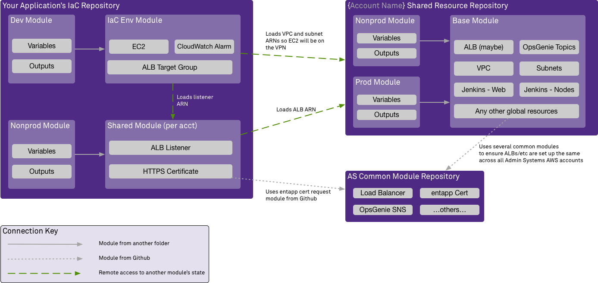

# Terraform
Infrastructure as Code (IaC) is a way to define what resources & configuration you need to run an application. These declarations can then be stored in git. This approach eliminates the potential for human error when setting up multiple servers & configuration drift between environments.

[Terraform](https://www.terraform.io/) is the vendor-agnostic IaC tool that Administrative Systems uses. When you write your IaC, terraform will determine which service providers you need and will automatically download the appropriate [provider drivers](https://www.terraform.io/docs/providers/index.html). 

For the most part, AS developers will only need to be concerned with the [AWS provider](https://www.terraform.io/docs/providers/aws/index.html). But if the need arises, you can use terraform to build infrastructure for one app across several cloud vendors.

:::danger Terraform v0.10
At this time, Terraform v0.10 is installed on all Jenkins servers.

When reviewing Terraform documentation, verify the docs are for v0.11 and before; v0.12 made significant changes to the syntax.

If you are testing locally, you can use [tfenv](https://github.com/tfutils/tfenv) to swap between versions.
:::

## Terraform Concepts
A simple terraform module is made up of three parts: provider blocks, a backend, and the infrastructure resources you want.

```hcl
# Provider Block
# --------------

# Declares that we need the AWS provider and sets a default region.
# The version argument tells TF that it should use any stable v2.27.x provider.
provider "aws" {
  region = "us-east-2"
  version = "~> 2.27"
}

# Backend Block
# -------------

# This block tells Terraform that it should remember what
# resources it has created using a file in an S3 bucket.
terraform {
  backend "s3" {
    bucket = "accountName-nonprod-build-tfstate"
    key    = "accountName-shared-resources/nonprod/terraform.tfstate"
    region = "us-east-2"
  }
}

# Resource Blocks
# ---------------

# Creates a Simple Notification Service topic
resource "aws_sns_topic" "opsgenie_alert_topic" {
  name = "OpsGenie-SomeTeam"
}

# Adds OpsGenie's alert API as a subscriber to that topic,
# using the Amazon Resource Name (ARN) that the previous resource
# output.
resource "aws_sns_topic_subscription" "opsgenie_integration" {
  topic_arn              = "${aws_sns_topic.opsgenie_alert_topic.arn}"
  protocol               = "https"
  endpoint               = "https://api.opsgenie.com/alert/SomeTeam?apiKey=MyVeryCoolSecret"
  endpoint_auto_confirms = true
}
```

Terraform will automatically determine that it needs to create the topic before it can create the subscription, since the subscription is using an *attribute* (the ARN) from the topic resource.

Every resource is different. The terraform AWS provider documentation will explain what arguments (inputs) & attributes (outputs) are available. For example, the [`aws_sns_topic`](https://www.terraform.io/docs/providers/aws/r/sns_topic.html) documentation tells us that we could set a `display_name` argument too.

## AS Terraform Modules
A collection of resources can be grouped into a terraform module, and the module can be invoked multiple times. This can be leveraged to declare all your infrastructure for an application in a *base module*, and then run that module (with some different variables) for dev, QA, and production.

Administrative Systems generally creates a folder structure like this:

```
├── base_module
│   ├── sns.tf
│   ├── output.tf
│   └── variables.tf
├── dev
│   ├── provider.tf
│   ├── state.tf
│   └── main.tf
└── qa
    ├── provider.tf
    ├── state.tf
    └── main.tf
```

You'll notice that the `provider.tf` and `state.tf` files move out to the environment. The `sns.tf` file in the `base_module` has the SNS topic and subscription from our last example, but there are two new files: `variables.tf`, which declares what arguments our *base module* has, and `outputs.tf`, which has its *attributes*. 

:::tip Terraform Files
Terraform is run for a given folder. It will evaluate all of the `*.tf` files in that folder as one module.

This means you can split your resources up across as many files as you like. We generally split them by service, e.g. `sns.tf` has the SNS config. 

We keep the `state.tf`, `variables.tf`, `provider.tf`, and `output.tf` in their own files. Otherwise, there are no rules -- you can split the infrastructure resources across as many (or few) files as makes sense for your project.
:::

The `main.tf` for the development environment would look like this:

```hcl
module "opsgenie_alert" {
    source = "../base_module"

    # These would be declared in the base_module's variables.tf
    environment = "development"
    team_name   = "MyTeam"
}
```

This ensures consistency between environments. The dev environment *must* be similar to the QA environment, because they are built using the exact same terraform module.

Modules are very powerful: you can nest modules and have them interact with each other via their outputs, include shared module code from Github repositories, and access the Terraform state from other IaC projects.

## Developing & Testing IaC
Before you begin, you should install the [terraform extension for VS Code](https://marketplace.visualstudio.com/items?itemName=mauve.terraform). This will give you a code formatter, syntax highlighting, tab completion, and quick navigation.

You may check your TF code compiles with the `terraform validate` command. You will need to `terraform init` your module beforehand. If the `init` gives you errors about the S3 bucket, that is OK: the state bucket is only needed when you are planning/deploying/destroying.

Infrastructure in the nonprod & prod accounts may only be created by terraform running on your Jenkins server -- your own AWS login will not be able to create anything. If you wish to test terraform from your own machine, you can log in to the sandbox with the [aws-adfs](https://github.com/venth/aws-adfs) utility.

:::tip `aws-adfs` & Duo
Before using the `aws-adfs` utility, you will need to configure Duo to automatically send you push notifications.

When logging in to [aws.northwestern.edu](https://aws.northwestern.edu), hit the *Settings* tab on your Duo popup, then *My Settings & Devices*.

Choose *Automatically Send this Device a Duo Push* to enable this functionality.
:::

Once installed, you can run the utility with the below arguments. Your username should be in the format `ads\netid`.

```sh
aws-adfs login --adfs-host=ads-fed.northwestern.edu --provider-id urn:amazon:webservices --region us-east-2
```

Once logged in, the utility will prompt you to choose the AWS account to use.

## Sharing Resources
The AS Cloud Services team will create and manage shared resources in your account -- things like an ALB, IP subnets, and the VPC. There will be one repository for each department's AWS accounts, with a base module covering everything the account needs and a sandbox/nonprod/production module to build the resources out in an appropriate manner.

Developers will need to use some of the attributes for these shared resources in their IaC. For example, running a Lambda in the VPC so it may access resources on campus requires the VPC ID and subnet IDs.

:::tip New Practice
The shared resource repository and remote access to state files is a fairly new practice. 

Historically, shared account resources were not created with terraform. VPC IDs/etc were hard coded in each project. 

The AS Cloud Services team is working to import these into terraform. If you find you need an attribute that isn't available, please let the AS Cloud Services team know!
:::

Declaring a VPC resource in an application's terraform module would be wrong: the VPC already exists, and declaring one would try to create a second VPC. Instead, an application would want to declare a remote resource and access information about about the already-created VPC.

### Example Application
To illustrate the resource and module sharing concepts, think about an application deployed on the Elastic Container Service (ECS). You need the following resources:

- Per account
    - Load balancer listener for the application (nonprod's would cover dev/qa)
    - HTTPS certificate for the load balancer

- Per application environment
    - Load balancer target group
    - ECS & EC2 resources
    - CloudWatch alarms

That is two modules you would require -- one for shared account resources, and one for the application's dev/QA/production/etc environments. Both of these modules will need information about the account's VPC, and what subnet IDs have been allocated for the application by the AS Cloud Services team.

The load balancer will require a certificate. There is a ready-made module for generating certificate requests under the `entapp.northwestern.edu` domain available in Github, so that can be used.

The per-application environment module will need to know the ARN for the load balancer listenen, so it can tie the target groups to it.



Generating the certificate with the module that the AS Cloud Services team has already provided is easy:

```hcl
# The hostname(s) will be passed in, as you'd want different ones for sandbox/nonprod/prod.
# This module will automatically decide if you need a SAN cert (supports multiple hostnames) or a regular
# cert (with one hostname).
module "certificate" {
    // The double slash IS significant <https://www.terraform.io/docs/modules/sources.html#modules-in-package-sub-directories>
    source = "github.com/NIT-Administrative-Systems/AS-Common-AWS-Modules//entapp_certificate"

    hostnames = ["${var.hostnames}"]
}
```

This will expose the certificate's ARN as an attribute, which will be used in the next example.

The per-account module can access the remote state of your account's shared resources by declaring a `terraform_remote_state` resource and providing it with the location of that module's state file:

```hcl
# You would pass the correct S3 bucket and file for the account in.
#
# Sandbox / nonprod / prod would all be slightly different bucket
# names and keys.
data "terraform_remote_state" "account_wide_alb" {
  backend = "s3"

  config = {
    bucket = "${var.alb_state_bucket}"
    key    = "${var.alb_state_file}"
    region = "${var.alb_state_region}"
  }
}

# And then you can access any attributes that your shared account resource module
# exposes with data.terraform_remote_state.{module_name}.{attribute}, as shown here
# in the load_balancer_arn argument.
#
# This also uses the certificate_arn attribute of the cert module we invoked in the
# previous example.
resource "aws_lb_listener" "lb_listener" {
    load_balancer_arn = "${data.terraform_remote_state.account_wide_alb.lb_arn}"
    port              = "443"
    protocol          = "HTTPS"
    ssl_policy        = "ELBSecurityPolicy-2016-08"
    certificate_arn   = "${module.certificate.certificate_arn}"

    default_action {
        type = "fixed-response"
        fixed_response {
            content_type = "text/plain"
            message_body = "No targets are responding to this request."
            status_code = "502"
        }
    }
}

# Exports the listener's ARN as an attribute. 
#
# You will need to access this in the per-environment module.
output "alb_listener_arn" {
    value = "${aws_lb_listener.lb_listener.arn}"
}
```

Using another `terraform_remote_state` resource, you can access the `alb_listener_arn` attribute in your per-environment module.