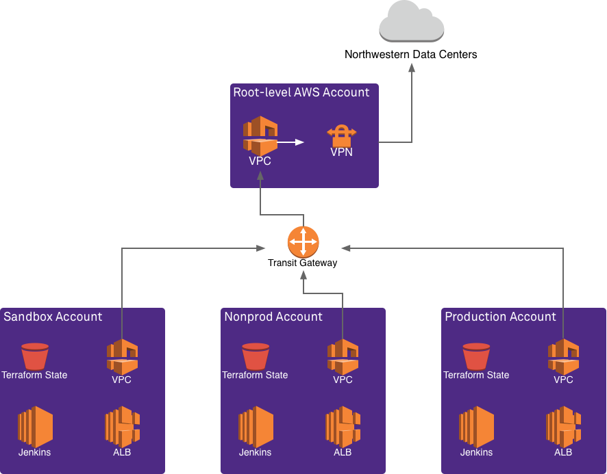

# AWS Account Structure
The AS AWS accounts are part of an overall Northwestern billing organization. Each department inside AS will receive three accounts. 

Our preferred region is `us-east-2`; it has the lowest latency from campus. This should be chosen unless there is a reason to choose different region(s).

| Environment   | Purpose                                                                          | Roles Given                                                               | 
|---------------|----------------------------------------------------------------------------------|---------------------------------------------------------------------------| 
| Sandbox (sbx) | Short-lived proof-of-concepts*, experimentation, and training.                    | Admin-level console access w/ few restrictions                            | 
| Non-prod      | Non-production applications. All resources created programatically by terraform. | Read-only console access, w/ admin granted via Jenkins' terraform API key | 
| Production    | Production applications. All resources created programatically by terraform.     | Read-only console access, w/ admin granted via Jenkins' terraform API key | 

<small>* *The AS Cloud Services team reserves the right to remove resources from the sandbox account if they are not actively being used. This account is not intended for long-running services.*</small>

These accounts will have a Virtual Private Cloud (VPC) with VPN access back to the Evanston & Chicago datacenters. The VPC is assigned a block IP addresses that are part of the Northwestern network. This block can be sub-divided further and given to the applications you deploy.

Each account will have a Jenkins server equipped with an AWS credential that can create things via terraform, Github integration, Docker, and the Teams plugin for notifications.

Each account will have an S3 bucket for use by terraform to hold its state files. These files track what infrastructure has been built and are necessary for terraform to run.

If and when you require it, an Application Load Balancer (ALB) can be created for the account by the AS Cloud Services team. This is an always-on service that may not be necessary if you are only using serverless services like API Gateway and CloudFront. To keep costs down, it is preferrable to build one ALB per account -- it can be shared by many applications.

Not all AWS resources live inside the VPC. For example, DynamoDB runs entirely on Amazon-managed networks and is accessible over the internet. A private DyanmoDB is not offered; it will never be able to access servers in our data centers over the VPN connection. Other services, like EC2 and Lambda, may run on AWS-managed networks by default, with an option to assign them subnets inside of the VPC.