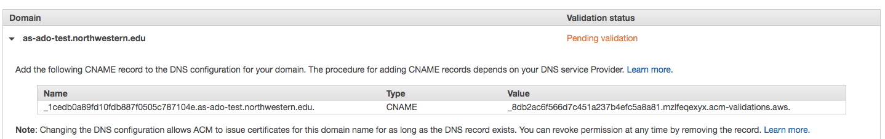

# Certificates
Amazon provides X.509 certificates, most commonly used for HTTPS, through the [AWS Certificate Manager](https://docs.aws.amazon.com/acm/latest/userguide/acm-overview.html) (ACM). Any certificates issued by Amazon will be short-lived auto-renewed certificates, eliminating the need for a bunch of manual configuration & webserver restarts.

You should always request certificates from Amazon through ACM for cloud applications. The EACD-CloudOps group does not recommend or support importing certificates issued by other CAs.

Amazon will only issue Domain Verified (DV) certificates. Issuing & renewing Extended Validation (EV) certificates cannot be automated, and [no longer offer any benefit](https://www.troyhunt.com/extended-validation-certificates-are-really-really-dead/) over DV certs. 

You may request a SAN certificate that covers several domains; this is useful for a single ALB listener that covers multiple environments.

## Usage
Certificate requests should be made as IaC [with terraform](https://www.terraform.io/docs/providers/aws/d/acm_certificate.html).

When you create a certificate request, ACM requires you to prove that you own the domain(s) you are requesting a certificate for. Until this is done, ACM will not create a certificate & attempting to reference the ARN in terraform will fail.

The request will be visible in the ACM console, at the 'Pending Validation' status. Amazon will ask you to create a subdomain for each domain you've requested a certificate for. Being able to create a subdomain on the requested domain(s) proves that you control that domain.

You will need to open a ticket for `NUIT-CI-SO-SOC` asking to create these DNS records for you:

<blockquote>
Hi SOC,
  
Can you please create the following two new CNAMEs for AWS cert validation:
  
CNAME: _d6486a2a6c2aecc5999c9263cd6ca914.as-ado-test.northwestern.edu. 
Target: _da2e93d6b676aad059a9995c82895502.mzlfeqexyx.acm-validations.aws.
  
Note that the leading underscores are significant; please make sure they get copy-pasted!
  
Thank you for your help.

</blockquote>

This must be completed within 72 hours or Amazon will abandon the certificate request. If that happens, you will need to delete the request and start over.

The DNS records created are **only** for establishing ownership of the domain. These records will not set up `as-ado-test.northwestern.edu`; you will need to make a separate request for that. 

These records must remain in DNS for the lifetime of the certificate. AWS re-checks them when it comes time to renew the certificate.