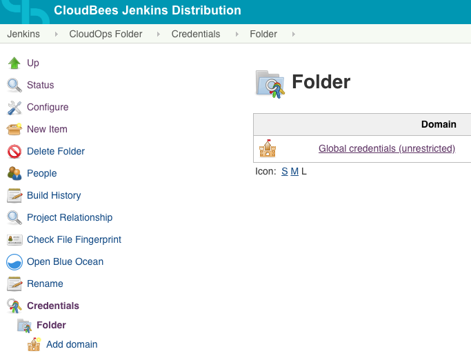
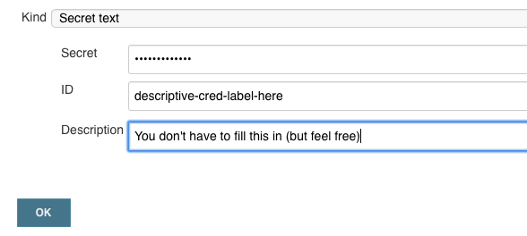

# Secret Management
Secrets like usernames, passwords, API keys, and private keys should be kept in Jenkins. They should not be hard-coded and included in a [GitHub repository](../github/policies.md#secrets), nor hard-coded into Jenkins pipelines or Docker images. 

Jenkins cannot share its credential store with other applications & services, but provides a convenient way for developers to manage secrets right alongside their infrastructure and app builds. To faciliate using credentials, the secrets kept in Jenkins should be published to the AWS Systems Manager (SSM) Paramater Store as encrypted values.

The SSM paramater store securely store secrets for use by your apps and other infrastructure. It has first-class integration for some services -- for example, the Elastic Container Service (ECS) can [decrypt and inject secrets from SSM automatically upon booting a container](https://docs.aws.amazon.com/AmazonECS/latest/developerguide/specifying-sensitive-data.html). For services that do not offer this integration, the AWS SDK can be used to access & decrypt secrets in your application code.

The SSM parameter store can hold other, not-secret config values too. That is beyond the scope of this article.

## Strategy
All Jenkins jobs are sorted into folders. Folders provide a security boundry for credentials: *only* jobs inside a folder can access credentials scoped to the folder. This way, an 'HR Enterprise' job would not have access to a 'Student Enterprise' credential. Groups of developers can be assigned permission to create/update/delete credentials for their folders.

There is a working demo of this strategy available in the [jenkins-credential-sync-test repository](https://github.com/NIT-Administrative-Systems/jenkins-credential-sync-test).

### Jenkins Setup
To create credentials in Jenkins, click into your folder > Credentials > Folder, and then select Global Credentials. You can add or update the credentials here.



When creating a credential, choose the secret text type. Make sure you specify the ID as a name you'll use for the SSM parameter. If you do not specify the ID, Jenkins will generate a UUID. You can go back and edit that so it's a descriptive label.



### Terraform Setup
The SSM parameter resources should be created by Terraform as IaC. The easiest way to do this is specifying a template resource and putting your parameter names in an array. The parameter names should be emitted as an output from your Terraform modules.

You may optionally create an application-specific encryption key for your secrets. This is free and has no downsides, so it is recommended to do so.

```hcl
# Make this a list of your secrets. These names should match the Jenkins credential IDs.
locals {
    parameters = ["jcst-demo-api-key", "jcst-password"]
}

# This will create two resources; one for each entry in the parameters array.
# You should customize the name for your app. 
# SSM is a a hierarchy, so "/your-app/env" is a good prefix!
resource "aws_ssm_parameter" "secure_param" {
  count = length(local.parameters)

  name        = "/jenkins-ssm-sync/tech-demo/${local.parameters[count.index]}"
  description = "Demo secret: ${local.parameters[count.index]}"
  type        = "SecureString"
  value       = "SSM parameter store not populated from Jenkins"
  key_id      = aws_kms_key.key.arn

  tags = {
    environment = "tech-demo"
  }

  # The parameter will be created with a dummy value. Jenkins will update it with 
  # the final value in a subsequent pipeline step.
  #
  # TF will not override the parameter once it has been created.
  lifecycle {
    ignore_changes = [value]
  }
}

output "parameters" {
    value = zipmap(local.parameters, slice(aws_ssm_parameter.secure_param.*.name, 0, length(local.parameters)))
}

resource "aws_kms_key" "key" {
  description = "Key for encrypting demo config"
}
```

This will create two encrypted SSM parameters with dummy values. 

### Pipeline
As part of your pipeline, you will want to call the [`publishSecretsToSSM` function from our shared Jenkins library](../ci-cd/shared-libs.md). 

You should do this in your infrastructure pipeline: the function depends on the Terraform module being initialized & applied, with the `parameters` output available. If your application has strong reasons to do this in another pipeline, ensure the infrastructure module has been `terraform init`-ed first.

<<< @/assets/sample-secret-pipeline.groovy

## Using Secrets
Here are some notes on common ways to use SSM secrets.

In all cases, the service will need to be given access to the KMS key before it can decrypt parameters -- granting your application access to an encrypted SSM parameter without the key will result in errors when you attempt to access the secret!

Here is an example policy, based on the parameter example above:

```hcl
data "aws_iam_policy_document" "lambda_secrets_policy" {
  statement {
    effect    = "Allow"
    actions   = ["ssm:GetParameters", "ssm:GetParameter"]
    resources = aws_ssm_parameter.secure_param.*.arn
  }

  statement {
    effect    = "Allow"
    actions   = ["kms:Decrypt"]
    resources = [aws_kms_key.key.arn]
  }
}

resource "aws_iam_role_policy" "lambda_secrets_policy" {
  name   = "SomeApp-Env-Secrets"
  policy = data.aws_iam_policy_document.lambda_secrets_policy.json

  # Your Lambda/ECS/etc execution role name
  role = ". . ."
}
```

### In the Console
By default, the KMS encryption key that you create will not be usable. You will grant your Lambda/ECS/etc `kms:Decrypt` access, but if you want to review your secrets in the console or use them from the CLI, there is an additional step -- granting the developer role you access AWS with access.

To avoid exposing secrets to other teams in your department, this access it not automatically granted. The [example IAM policy above](#using-secrets) could specify your login group's name instead of an execution role name, in order to enable decryption in the AWS Console.

```hcl
data "aws_iam_role" "developers" {
  name = "as-ado-sbx-Devs-EACD"
}

resource "aws_iam_role_policy" "lambda_secrets_policy" {
  name   = "SomeApp-SomeEnv-DeveloperDecryptSecrets"
  role   = data.aws_iam_role.developers.name
  policy = data.aws_iam_policy_document.lambda_secrets_policy.json
}
```

The IAM article [has a list of available roles](./iam.md#developer-roles).

### ECS
In your ECS [task definition](https://docs.aws.amazon.com/AmazonECS/latest/developerguide/task_definition_parameters.html), you can specify a `secrets` section with the ARNs for your parameters. They will automatically be decrypted and injected into your container as environment variables when it is started:

```json{11-13}
{
    "cpu": 1024,
    "memory": 2048,
    "name": "my-cool-task",
    "portMappings": [{
        "containerPort": 80,
        "hostPort": 80
    }],
    "essential": true,
    "image": "${aws_ecr_repository.my_ecr.repository_url}:latest",
    "secrets" : [
        {"name": "${local.ssm_params[0]}", "valueFrom": "${aws_ssm_parameter.secure_param.0.arn}"}
    ]
}
```

### Lambda
Lambda does not have a native integration for SSM parameters. However, AWS offers SDKs for most languages: Python, Java, PHP, etc. that are all similar. 

Here is an example using the AWS Javascript SDK:

```js
const AWS = require('aws-sdk');
const ssm = new AWS.SSM({
  region: 'us-east-2',
});

const ssmResponse = await ssm.getParameter({
    Name: '/jenkins-ssm-sync/tech-demo/jcst-password',
    WithDecryption: true,
}).promise();

return ssmResponse.Parameter.Value;
```

If you are scheduling a Lambda to be run through CloudWatch or a Step Function, you can use Terraform to inject the full parameter name into the event that invokes the Lambda. Then you won't need to worry about keeping the parameter names in sync between SSM and your codebase.
